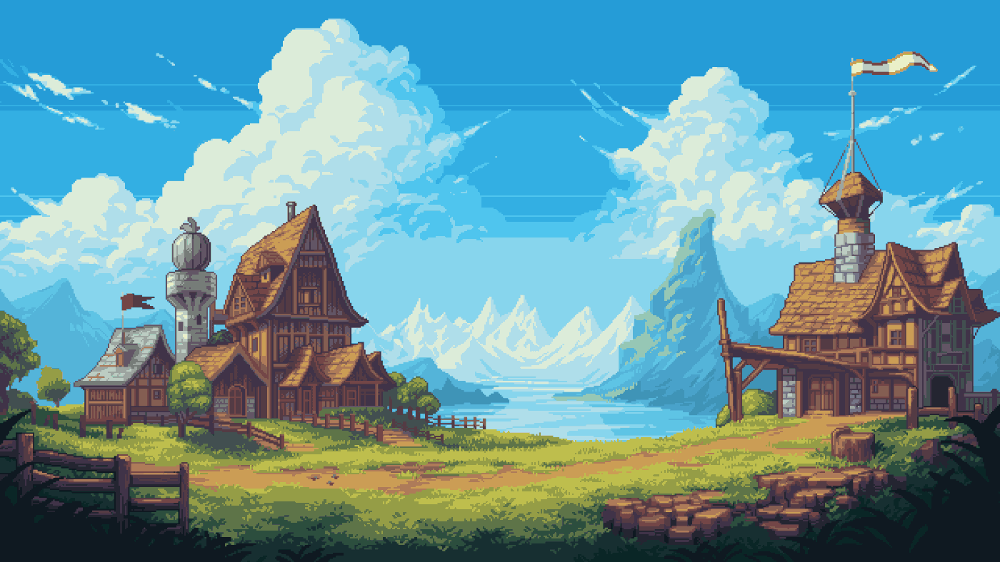

<p align="center">
  
</p>

<h1 align="center">Olá, eu sou o Renan 👋</h1>

<p align="center">
  <b>Estudante de Desenvolvimento de Sistemas</b> • <b>Software</b> • <b>Automação</b>
</p>

<p align="center">
  <a href="https://github.com/renandias3158">
    
  </a>
</p>

---

### Sobre mim

🎓 Estudante do ensino médio técnico em **Desenvolvimento de Sistemas**.

💻 Tenho interesse em **Engenharia de Software, automação, robótica e desenvolvimento de jogos**.

🧠 Atualmente, estou aprimorando meus conhecimentos em programação e desenvolvimento de sistemas, explorando diferentes tecnologias e formas de construir projetos.

---

### Tecnologias

<div align="center">


</div>

---

### Projetos

Alguns projetos que fazem parte da minha jornada:

| Projeto                | Descrição                                       |
| ---------------------- | ----------------------------------------------- |
| **FeynParet-Study**    | Projeto desenvolvido em Python                  |
| **CorrerIA-IFPE**      | Projeto utilizando JavaScript                   |
| **Projeto AV3**        | Projeto web desenvolvido em HTML                |
| **Handlebars do Node** | Estudos e experimentos com Node.js e Handlebars |

---

### Atualmente

```text
Aprendendo      → Desenvolvimento de Software
Explorando      → Automação e IA
Estudando       → Engenharia de Software
Interessado     → Robótica e Jogos
Construindo     → Projetos e experiências
```

---

<table align="center"> <tr> <td>  </td> <td>  </td> </tr> </table>

<p align="center">
  <i>“Código é apenas o começo.”</i>
</p>
